- 👋 Hi, I'm @tanyasinghp
- 👀 Product × AI/ML × Data Science
- 🌱 Building Generative AI systems - Knowledge Graphs • Agentic Systems • LLM Evaluation • Enterprise AI • System Design
- 💞️ Always open to collaborating on impactful projects and exchanging ideas with curious builders
- 🚀 DM me if there's a cool open-source project or case study I can contribute to!

## 🌐 Socials
  

# 💻 Tech Stack

## 📊 GitHub Analytics

<!-- 

  
  

 -->

  <picture>
    <source media="(prefers-color-scheme: dark)" srcset="https://raw.githubusercontent.com/tanyasinghp/tanyasinghp/output/github-contribution-grid-snake-dark.svg" />
    <source media="(prefers-color-scheme: light)" srcset="https://raw.githubusercontent.com/tanyasinghp/tanyasinghp/output/github-contribution-grid-snake.svg" />
    
  </picture>

<!-- 

  

 -->

  

<!--# 📊 GitHub Stats:
 

---

<!-- Proudly created with GPRM ( https://gprm.itsvg.in ) -->
<!---  
tanyasinghp/tanyasinghp is a ✨ special ✨ repository because its `README.md` (this file) appears on your GitHub profile.
You can click the Preview link to take a look at your changes.

